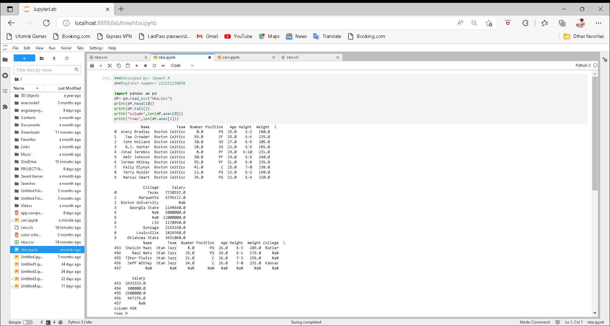

# Read-from-CSV

## AIM:
To find lenth of Rows and Colums using pandas.

## ALGORITHM:
### Step 1:
Import panda as pd

### Step 2:
For reading data we put code.

### Step 3:
We give print(head(10)) to get a output of first 10 lines.

### Step 4:
We give print(tail()) to get a output of last 5 lines.

### Step 5:
Next we have to put code for gret length of row and column.

## PROGRAM:
```
###Developed by: Janani R
###Register number: 212221230039

import pandas as pd
df= pd.read_csv("nba.csv")
print(df.head(10))
print(df.tail())
print("column",len(df.axes[0]))
print("rows",len(df.axes[1]))
```
## OUTPUT:


## RESULT:
Successfully found the length of Rows and Columns using pandas.
